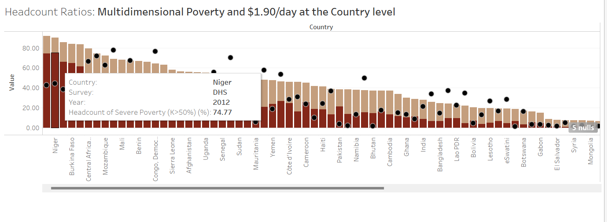

# solid-garbanzo
Alternate options to visualize MPI headcount vs $1.90 per day poverty

This repository is to experiment and generate options to visualize MPI headcount vs $1.90 a day poverty headcount for the OPHI Data bank.

## The current visualization

